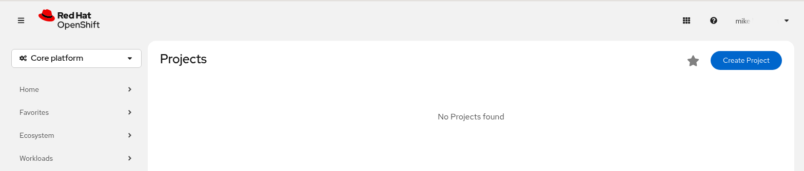
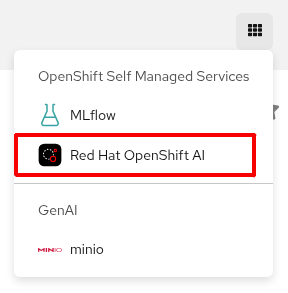
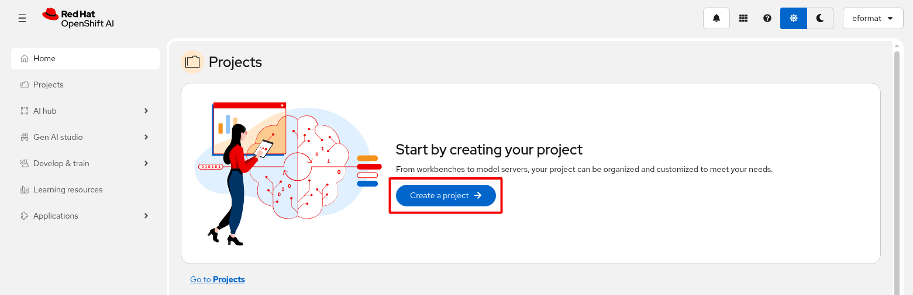
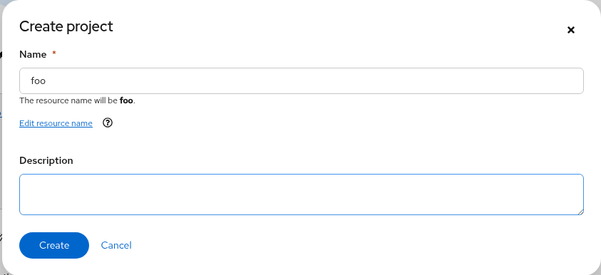
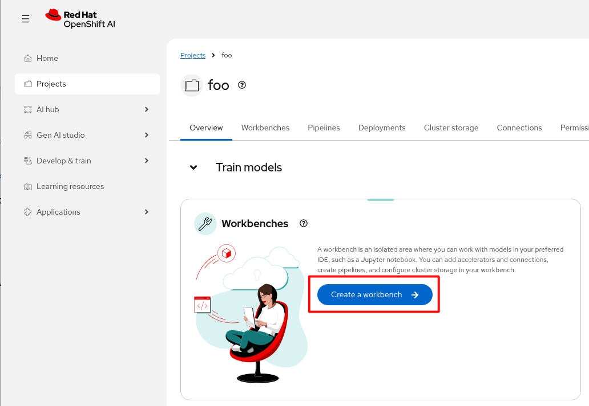
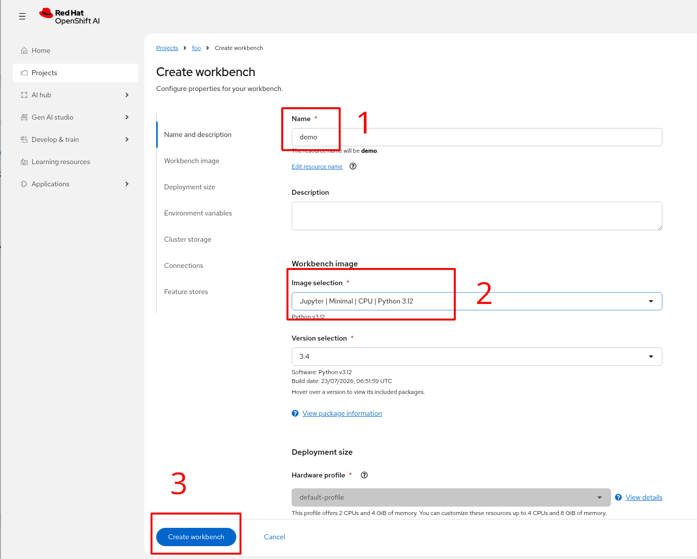
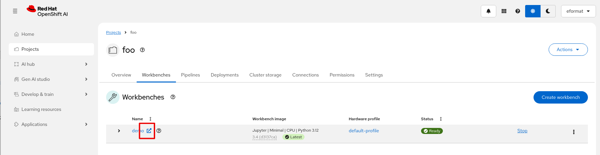
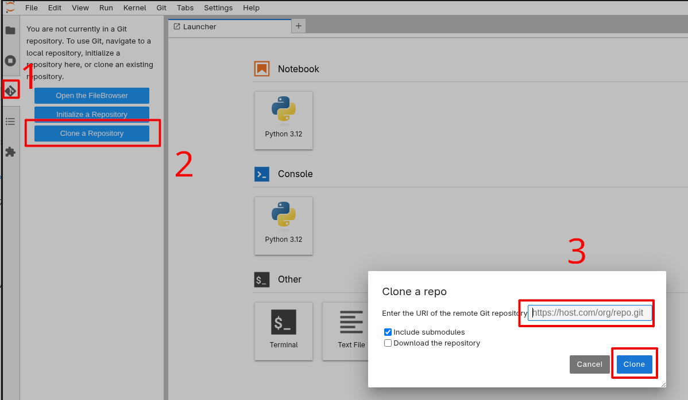

# ai-nz-hackathon-2026

Helpful collection of getting started notebooks.

1. First Login - no projects found. Don't click Create Project (that's an OpenShift project).

2. Login to RHOAI first. Hamburger menu top right.

3. Create a Data Science Project instead.

4. Name your project.

5. Create a workbench.

6. Workbench details - `Name`, `Image (Jupyter | Minimal CPU | Python 3.12)` - Create workbench.

7. Open workbench.

8. Clone this git repo https://github.com/eformat/ai-nz-hackathon-2026 and use the Notebooks.

## Notebooks in this repo

[01-getting-connected.ipynb - Getting connected](01-getting-connected.ipynb)

[02-connecting-to-mlflow.ipynb - Connecting to MLFLow](02-connecting-to-mlflow.ipynb)

[03-notebook-proxy-chainlit.ipynb - Chat application](03-notebook-proxy-chainlit.ipynb)

[04-deploy-container-app.ipynb - Deploy a simple container app](04-deploy-container-app.ipynb)

[05-deploy-dockerfile-app.ipynb - Build and deploy a container app](05-deploy-dockerfile-app.ipynb)
